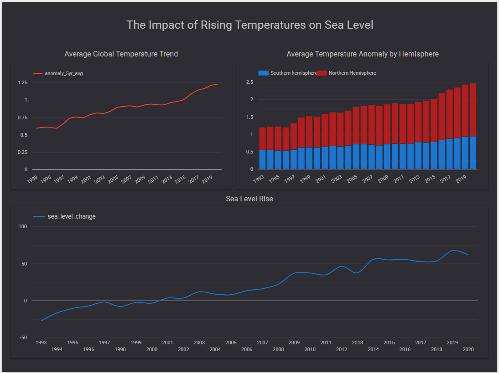

# 🌍 Climate Data Engineering Pipeline (GCP + Terraform + Bruin)

An end-to-end **batch data engineering pipeline** built on Google Cloud Platform (GCP). The pipeline ingests public climate datasets, stores raw files in a cloud data lake (GCS), transforms them in a data warehouse (BigQuery), and visualises the results in a Looker Studio dashboard.

Built as a portfolio project demonstrating modern data engineering practices:
- Infrastructure as Code (Terraform)
- Workflow orchestration (Bruin)
- Cloud data lake (Google Cloud Storage)
- Analytical data warehouse with partitioning and clustering (BigQuery)
- Data visualisation (Looker Studio)

---

## 🏗️ Architecture

The pipeline follows a structured flow from raw data ingestion to analytics:

1. **Extract**
   Python scripts fetch climate data from **Our World in Data**.

2. **Load (Data Lake)**
   Raw CSV files are stored in **Google Cloud Storage (GCS)**.

3. **Stage (Data Warehouse)**
   Data is loaded into **BigQuery staging tables**.

4. **Transform (Data Warehouse Mart)**
   SQL transformations aggregate and model the data into optimized **BigQuery fact tables** (partitioned by year, clustered by entity).

5. **Visualize**
   Insights are presented through a **Looker Studio dashboard**.

**Why two layers in BigQuery (staging + mart)?**
Staging is a direct copy of what is in GCS — no transformation, no business logic. If something goes wrong in a transformation, you can always re-run the SQL against staging without re-downloading the source data. The mart is what dashboards connect to — it is clean, optimised, and never changes shape unexpectedly.

---

## 🛠️ Technology Stack

| Layer | Technology | Why |
|---|---|---|
| Infrastructure as Code | Terraform 1.7 | Reproducible, version-controlled GCP resources |
| Cloud Platform | GCP | BigQuery + GCS are best-in-class for analytical workloads |
| Data Lake | Google Cloud Storage | Cheap, durable object storage for raw CSV files |
| Orchestration | Bruin CLI | Lightweight pipeline orchestration with built-in GCP connectors |
| Data Warehouse | BigQuery | Serverless, scalable SQL warehouse with partitioning/clustering |
| Visualisation | Looker Studio | Free, native BigQuery connector, shareable dashboards |
| Language | Python 3 | pandas + google-cloud-* libraries |
| Dependency Management | uv | Fast, reliable Python package management |

---

## 📊 Datasets Used

The pipeline uses publicly available climate datasets from **Our World in Data**:

### 🌡️ Global Temperature Anomalies
Yearly deviations from long-term global temperature averages.

### 🌊 Global Sea Level Rise
Historical measurements tracking changes in global mean sea level.

---

## 📂 Project Structure

```text
climate-correlation-engine/
├── .devcontainer/
│   ├── devcontainer.json       # Codespaces container definition
│   └── setup.sh                # Auto-installs gcloud, Bruin CLI, uv, Python deps
│
├── terraform/
│   ├── provider.tf             # Google provider version pin
│   ├── variables.tf            # project_id, region, bq_location
│   ├── main.tf                 # GCS bucket + BigQuery datasets + tables
│   ├── outputs.tf              # Prints resource names after apply
│   └── terraform.tfvars.example  # Template — copy to terraform.tfvars
│
├── pipelines/
│   ├── temperature_pipeline/
│   │       ├── pipeline.yml        # Bruin schedule + venv config
│   │       └── assets/
│   │            ├── bigquery/
│   │            │     └── temperature_model.sql   # staging → mart (5yr rolling avg)
│   │            ├── ingestion/
│   │            │     └── download_temperature.py # Download temperature CSV → upload to GCS
│   │            └── staging/
│   │                   └── load_to_staging.py     # GCS → BigQuery staging
│   │
│   └── sea_level_pipeline/
│           ├── pipeline.yml        # Bruin schedule + venv config
│           └── assets/
│                ├── bigquery/
│                │     └── sea_level_model.sql     # staging → mart (YoY change in mm)
│                ├── ingestion/
│                │     └── download_sea_level.py   # Download sea level CSV → upload to GCS
│                └── staging/
│                      └── load_to_staging.py      # GCS → BigQuery staging
│
├── scripts/
│   └── run_pipeline.sh         # Runs all steps end-to-end via Bruin
│
├── bruin.config.yml.example    # Bruin ADC config template — copy to .bruin.yml
├── requirements.txt            # Python dependencies
├── .gitignore
└── README.md
```

---

## 🚀 Setup & Execution

### Step 1 — Open in GitHub Codespaces

1. Push this repository to GitHub.
2. Click **Code → Codespaces → Create codespace on main**.
3. Codespaces will automatically run `.devcontainer/setup.sh` which installs:
   - Google Cloud SDK (`gcloud`, `bq`, `gsutil`)
   - Bruin CLI
   - Python uv + all packages from `requirements.txt` into an isolated venv at `.venv/`
4. Wait for the **"Devcontainer setup complete"** message in the terminal.

**What the venv is for:**
The `.venv` is a Python virtual environment managed by `uv`. All ingestion and pipeline scripts run inside it. Bruin is configured to use `.venv/bin/python` as its interpreter, so it always uses the same package versions — no version conflicts, no "works on my machine" problems.

---

### Step 2 — Create a GCP Project

1. Go to [console.cloud.google.com](https://console.cloud.google.com)
2. Create a new project (e.g. `climate-pipeline-123`). Note the **Project ID** — it looks like `climate-pipeline-123`, not the display name.
3. Enable billing on the project (required for BigQuery and GCS).
4. Enable the required APIs:
   ```bash
   gcloud services enable bigquery.googleapis.com storage.googleapis.com \
     --project=your-project-id
   ```

---

### Step 3 — Authenticate with GCP

Inside the Codespaces terminal:

```bash
# Log in with your Google account — opens a browser link
gcloud auth application-default login

# Set the quota project to avoid "API not enabled" errors
gcloud auth application-default set-quota-project your-project-id

# Set your active project
gcloud config set project your-project-id
```

**What application-default login does:**
It creates a credentials file at `~/.config/gcloud/application_default_credentials.json`. All `google-cloud-*` Python libraries and Bruin automatically pick this file up via Application Default Credentials (ADC) — no credentials need to be passed in code.

> **After every Codespaces restart** you must re-run these three commands. To verify your auth is active at any time:
> ```bash
> gcloud auth application-default print-access-token
> ```
> A long token string means you are authenticated.

---

### Step 4 — Provision GCP Infrastructure with Terraform

Terraform creates the GCS bucket and BigQuery datasets/tables. Run this once (or again if you destroy and recreate).

```bash
# Copy the example vars file and fill in your project ID
cp terraform/terraform.tfvars.example terraform/terraform.tfvars
# Edit terraform.tfvars and set: project_id = "your-project-id"

cd terraform
terraform init      # downloads the Google provider plugin
terraform plan      # shows what will be created — review before applying
terraform apply     # type 'yes' to confirm and create resources
cd ..
```

**What Terraform creates:**

| Resource | Name | Purpose |
|---|---|---|
| GCS Bucket | `your-project-id-climate-data-lake` | Raw CSV files (data lake) |
| BQ Dataset | `climate_staging` | Direct copy of raw GCS data, no transformation |
| BQ Table | `stg_temperature` | Raw temperature rows |
| BQ Table | `stg_sea_level` | Raw sea level rows |
| BQ Dataset | `climate_mart` | Analytics-ready, dashboard-facing data |
| BQ Table | `fact_temperature` | Partitioned by year, clustered by entity |
| BQ Table | `fact_sea_level` | Partitioned by year, clustered by entity |

**Why partitioning and clustering matter:**
BigQuery charges per byte scanned. A dashboard query filtering to 1990–2020 on an unpartitioned table scans every row since 1880. With year-range partitioning, BigQuery skips all partitions outside the query range — typically an 80–90% cost reduction. Clustering by `entity` means filtering `WHERE entity = 'World'` reads only that entity's sorted blocks, not the full partition.

---

### Step 5 — Configure Bruin

Bruin uses Application Default Credentials (ADC) for authentication in development — the same credentials set up in Step 3. No service account key is needed for local development.

Copy the config template to the project root and set your project ID:

```bash
cp bruin.config.yml.example .bruin.yml
# Edit .bruin.yml and replace "your-gcp-project-id" with your actual project ID
```

The `.bruin.yml` file is gitignored — it never gets committed to the repository.

> **For production / CI/CD:** A service account key should be used instead of ADC.
> See `bruin.config.yml.example` for the service account configuration options.

---

### Step 6 — Set Environment Variables

The pipeline scripts read `GCS_BUCKET` and `GCP_PROJECT` from environment variables.

```bash
export GCS_BUCKET="your-project-id-climate-data-lake"
export GCP_PROJECT="your-project-id"
```

To persist across Codespaces restarts, store these as **Codespaces secrets**:
1. Go to **github.com → Settings → Codespaces → Secrets**
2. Add `GCS_BUCKET` with value `your-project-id-climate-data-lake`
3. Add `GCP_PROJECT` with value `your-project-id`

Codespaces secrets are injected automatically into every container as environment variables.

---

### Step 7 — Run the Pipeline

```bash
bash scripts/run_pipeline.sh
```

This runs both pipelines end-to-end via Bruin, which executes each pipeline's three assets in dependency order:

```
ingest.download_*          ← downloads CSV from Our World in Data → uploads to GCS
        ↓
staging.load_*             ← reads GCS CSV → loads into BigQuery staging (WRITE_TRUNCATE)
        ↓
mart.fact_*                ← transforms staging → BigQuery mart (partitioned + clustered)
```

You can also run each pipeline individually:
```bash
bruin run pipelines/temperature_pipeline/pipeline.yml
bruin run pipelines/sea_level_pipeline/pipeline.yml
```

---

### Step 8 — Build the Looker Studio Dashboard

1. Go to [lookerstudio.google.com](https://lookerstudio.google.com)
2. Click **Create → Report**
3. Select **BigQuery** as the data source
4. Choose your project → `climate_mart` → `fact_temperature`
5. Add a second data source: `climate_mart` → `fact_sea_level`

---

## 📈 Analytics Dashboard

The [dashboard](https://lookerstudio.google.com/s/prJqqQKm6lI) provides three analytical views:

**Global Temperature Trend** — line chart showing annual temperature anomalies:
- Dimension: `year`
- Metric: `anomaly_5yr_avg`
- Filter: `entity = 'World'`
- Shows the long-term warming trend as a smooth 5-year rolling average line

**Hemisphere Temperature Distribution** — bar chart showing hemisphere annual temperature anomalies:
- Dimension: `year`
- Metric: `anomaly_5yr_avg`
- Filter: `entity = 'Southern Hemisphere'` or `entity = 'Northern Hemisphere'`
- Shows a stacked bar chart of hemisphere warming

**Sea Level Change** — line chart visualising long-term rising sea levels:
- Dimension: `year`
- Metric: `sea_level_change`
- Filter: `entity = 'World'`
- Shows cumulative sea level rise in mm



---

## 🔄 Scheduling

The `schedule` field in `pipeline.yml` (`0 2 * * *`) documents the intended daily cadence and is used by external orchestrators. The Bruin open-source CLI does not include a built-in scheduler daemon — pipelines are triggered manually with `bruin run` or via an external scheduler.

**Options for automated scheduling:**

| Option | Cost | Effort |
|---|---|---|
| GitHub Actions (recommended) | Free on public repos | Low — one workflow YAML file |
| Bruin Cloud | Paid managed service | Very low — connect your repo |
| GCP Cloud Run Jobs | Pay per execution (~free at this scale) | Medium — containerise the pipeline |

---

## 📈 Data Model

### `climate_mart.fact_temperature`

| Column | Type | Description |
|---|---|---|
| year | INTEGER | Calendar year |
| entity | STRING | Country or region (e.g. 'World') |
| temperature_anomaly | FLOAT | Annual deviation from 1951–1980 baseline (°C) |
| anomaly_5yr_avg | FLOAT | 5-year rolling average anomaly (°C) |

Partitioned by: `year` (range 1850–2100, interval 10)
Clustered by: `entity`

### `climate_mart.fact_sea_level`

| Column | Type | Description |
|---|---|---|
| year | INTEGER | Calendar year |
| entity | STRING | Country or region |
| sea_level_change | FLOAT | Cumulative rise from 1880 baseline (mm) |
| yoy_change_mm | FLOAT | Year-over-year change (mm) |

Partitioned by: `year` (range 1850–2100, interval 10)
Clustered by: `entity`

---

## 🔮 Future Improvements

- **Data quality checks** — validate row counts, null rates, and anomaly bounds before loading to mart
- **Incremental loading** — only process new years rather than full refresh each run
- **CI/CD** — GitHub Actions workflow for automated daily runs and Terraform plan validation on pull requests
- **Schema detection** — auto-detect column renames in Our World in Data source files
- **Additional datasets** — CO₂ emissions, Arctic ice extent, extreme weather events

---

## 🔒 Security Notes

- `terraform.tfvars` is gitignored — never commit your real project ID alongside credentials
- `.bruin.yml` is gitignored — stored at the project root but never committed
- Service account keys (`~/.gcp/`) are stored outside the repo in the home directory
- Application default credentials (`~/.config/gcloud/`) are Codespaces-local and never persisted to the repo
- `GCS_BUCKET` and `GCP_PROJECT` are stored as Codespaces secrets, not hardcoded

---
